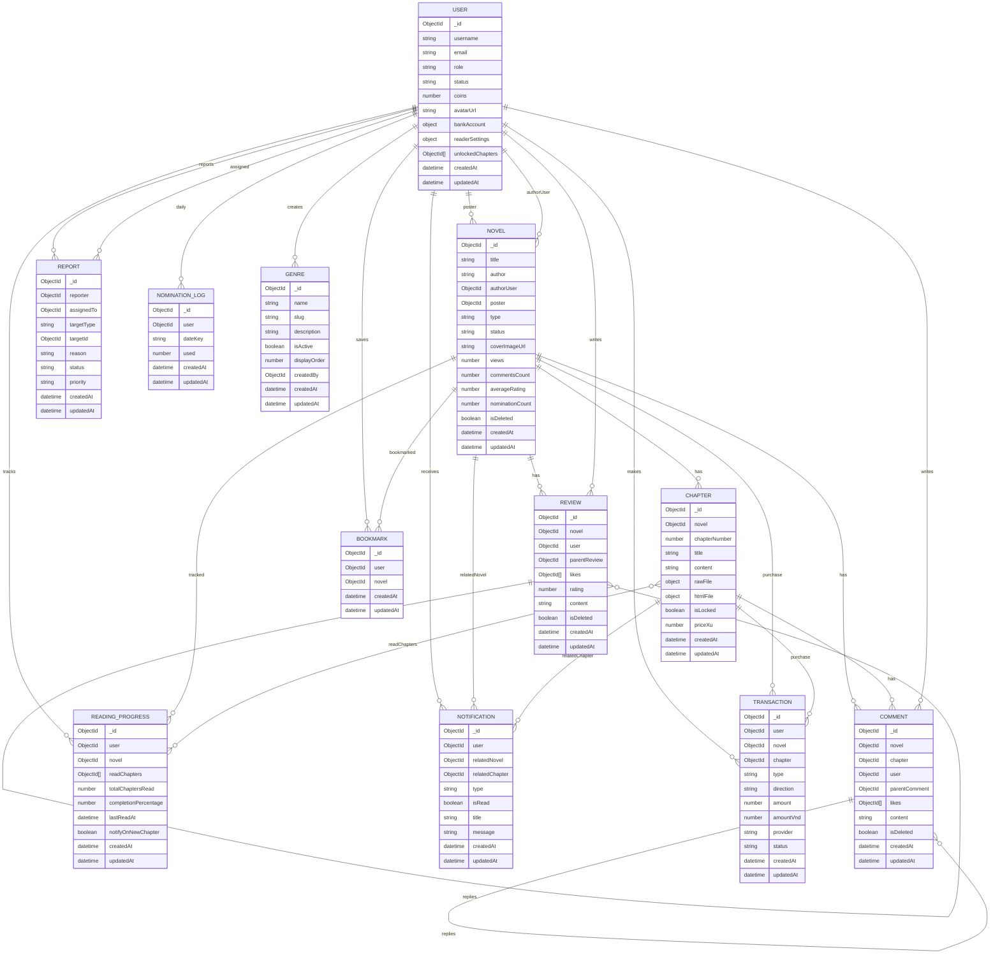

# ERD (Entity Relationship Diagram)

Ghi chú:
- `Novel.genres` lưu mảng chuỗi nên không ràng buộc trực tiếp với `Genre`.
- `Report.targetId` là quan hệ đa hình theo `targetType`.
- Một số trường (file metadata, settings) là đối tượng nhúng nên không tách thành thực thể riêng.
